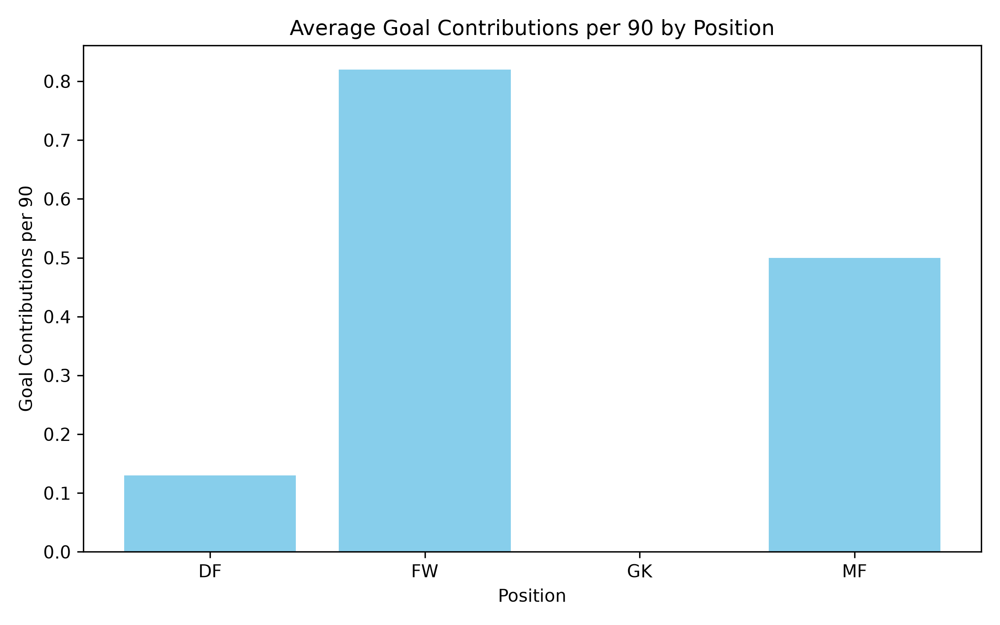
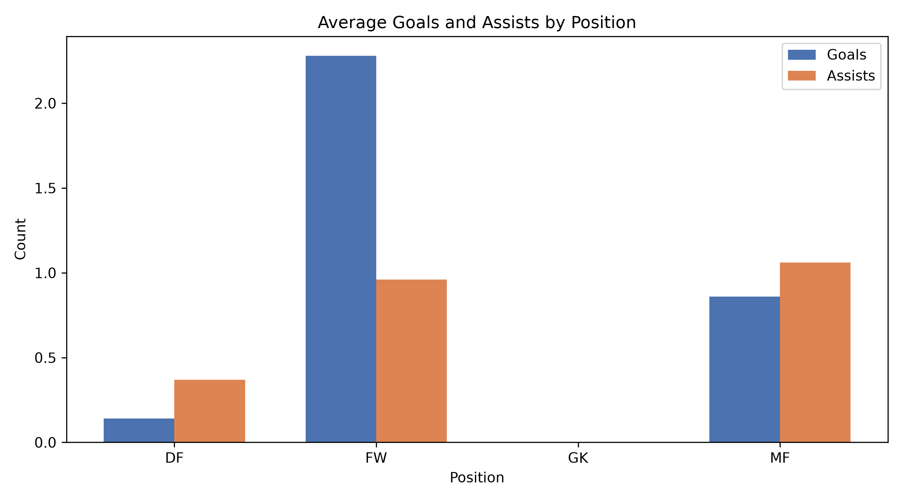
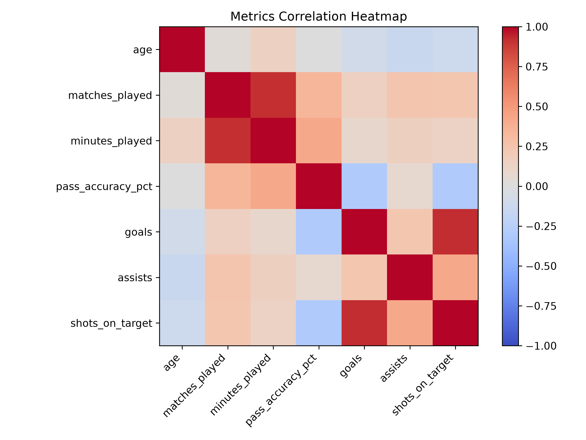

\# FIFA World Cup 2026 Player Analytics Dashboard ⚽

A Python-based data analytics project that explores FIFA World Cup 2026 player statistics and provides interactive visual insights.

\## Features

\- Player performance analysis

\- Goal and assist analysis

\- Age distribution analysis

\- Passing accuracy analysis

\- Correlation analysis

\- Interactive Streamlit dashboard

\## Technologies Used

\- Python

\- Pandas

\- NumPy

\- Matplotlib

\- Seaborn

\- Streamlit

\## Project Structure

\- `app.py` - Streamlit dashboard

\- `players.py` - Data processing

\- CSV files - Player datasets

\- PNG files - Generated visualizations

\## Team

Developed by:

\- Fahad Ahmad

\- Subhan Yousaf

\## How to Run

Install requirements:

## Dashboard Preview

### Goal Contributions

### Goals vs Assists

### Correlation Heatmap

